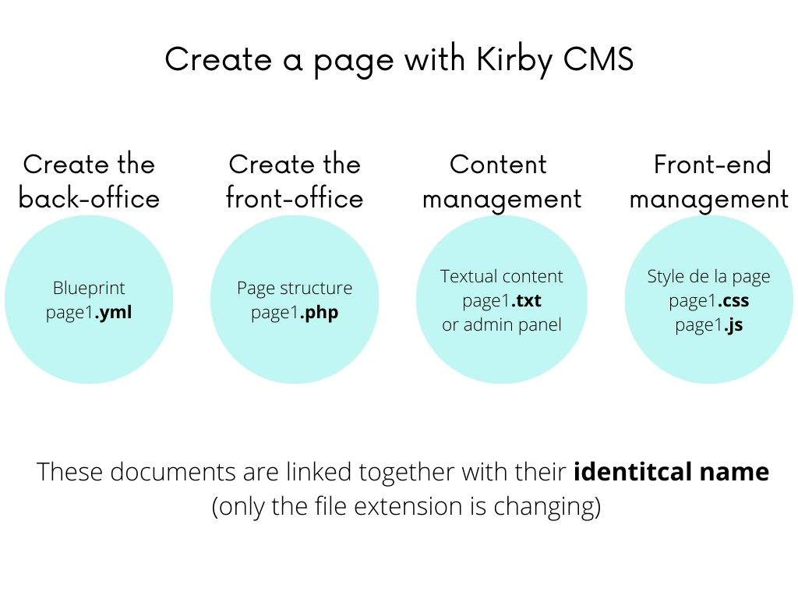

# Artist's portfolio 🎨

Hi 👋 Jiro Jasmin here.  
This project is a web portfolio of a contemporary visual French artist 🎨  
This is a professional project actually on production!  
  
Find a funny animation on homepage (inspired by 2000s boucing DVD waiting screen!),  
scroll through the work of the artist with a dynamic scrollable menu,  
and check their latest exhibitions!  
You can change the language of the website by clicking on the very bottom-left button!  
Moreoever, there is a custom admin panel to access the database made with Kirby CMS 👨‍💻  
Kirby is a light-weight CMS which perfectly fits this type of project using LAMP stack,  
with no SQL database for more simplicity and less weight!  
  
> Special thanks to the client Fabiola Amaudric who allowed me to publish the source code of this project ✨ (I deleted the content data though)  
  
---  
  
🚀 **[Click here to access to the online website](https://fabiolaamaudricduchaffaut.fr/)** 🚀  
   
Alternatively, click here to watch a video demo:  
 

  
---
  
## 🔧 Tools

- Native PHP
- Native Javascript
- CSS for full responsiveness (from narrow smartwatch to TV screen!)
- *.txt* for textual content data
- *.yml* to custom the admin panel

## 🪄 Features

- Dynamic pages with French/English toggler
- Customable and responsive animation on homepage, and responsive animation on scroll for the works' menu
- Custom admin panel made with Kirby CMS
- Manageable SEO with Kirby Meta plugin

## 🧐 How to navigate in this repository

The *content* folder contains, as it implies, the textual content and media content (here, images) of the project. Each file is linked with a php page automatically; please check this quick illustration I made:  

The *site* folder contains the *blueprint* folder with *.yml* files, in which one can create custom admin pages in the panel for content management.
  
The *template* folder contains actual pages, in php, which comprise *snippets* (which could be the equivalent of the 'components' with Next.js).  
  
For more information, please refer to the [Kirby docs](https://getkirby.com/docs/guide).  

## ⚠️ If you download this repository, make sure to  

### 1. Download Kirby CMS (it's free for personal use!)  

You will then be able to create an account to access the custom admin panel

### 2. Add your own data from panel  

I have deleted most of the content data in this repository, so please add more to have a closer experience with the project on production.  
  
## 📰 About this project  
  
Please note that I have made this project during an internship in summer 2022, with a manager who helped me take design decisions. This was my very first professional project with an actual client. 👨‍💼  
It has been produced according to functional and technical specifications agreed with the client, under an agile method using Trello, Zoom and IRL meetings.  
 
I have made a final internship report (~30 pages document) that I would be glad to share if you ask me in DM; however, it is entirely written in French...

In any case, I am still open for any reviews or thoughts, so please do not hesitate to tell me 😊

[Click here](https://github.com/jiro-jasmin?tab=repositories) to access to all my online repositories.  
Thank you for visiting my profile!  

If you would like to reach me, please contact me on my [LinkedIn profile here](https://www.linkedin.com/in/florian-j-giraud-8449091b8).
